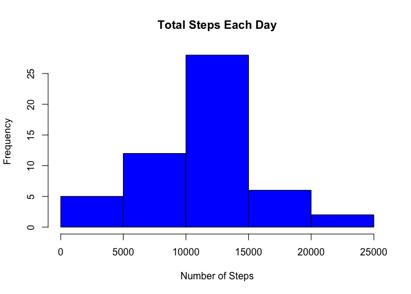

# Reproducible Research: Peer Assessment 1


## Loading and preprocessing the data
>Show any code that is needed to

 1. Load the data (i.e. read.csv())
 
 2. Process/transform the data (if necessary) into a format suitable for your analysis


```r
data <- read.csv("activity.csv")
```

A portion of the original dataset is as follows:

```
##    steps       date interval
## 1     NA 2012-10-01        0
## 2     NA 2012-10-01        5
## 3     NA 2012-10-01       10
## 4     NA 2012-10-01       15
## 5     NA 2012-10-01       20
## 6     NA 2012-10-01       25
## 7     NA 2012-10-01       30
## 8     NA 2012-10-01       35
## 9     NA 2012-10-01       40
## 10    NA 2012-10-01       45
## 11    NA 2012-10-01       50
## 12    NA 2012-10-01       55
## 13    NA 2012-10-01      100
## 14    NA 2012-10-01      105
## 15    NA 2012-10-01      110
## 16    NA 2012-10-01      115
## 17    NA 2012-10-01      120
## 18    NA 2012-10-01      125
## 19    NA 2012-10-01      130
## 20    NA 2012-10-01      135
```

### What is mean total number of steps taken per day?

For this part of the assignment, you can ignore the missing values in
the dataset.

1. Make a histogram of the total number of steps taken each day

2. Calculate and report the **mean** and **median** total number of steps taken per day


```r
steps_by_day <- aggregate(steps ~ date, data, sum)
hist(steps_by_day$steps, main = paste("Total Steps Each Day"), col="blue", xlab="Number of Steps")
```

 


1. Mean

```r
      rmean <- mean(steps_by_day$steps,na.rm = TRUE)
```

```
## [1] 10766.19
```
2. Median

```r
      rmedian <- median(steps_by_day$steps)
```

```
## [1] 10765
```


## What is the average daily activity pattern?

* Calculate average steps for each interval for all days. 
* Plot the Average Number Steps per Day by Interval. 
* Find interval with most average steps. 

```r
steps_by_interval <- aggregate(steps ~ interval, data, mean)

plot(steps_by_interval$interval,steps_by_interval$steps, type="l", xlab="Interval", ylab="Number of Steps",main="Average Number of Steps per Day by Interval")
```

 

```r
max_interval <- steps_by_interval[which.max(steps_by_interval$steps),1]
```

Maximum number of steps interval :  **835**  to  **840** minutes.


## Impute missing values. Compare imputed to non-imputed data.
Missing data needed to be imputed. Only a simple imputation approach was required for this assignment. 
Missing values were imputed by inserting the average for each interval. 


```r
incomplete <- sum(!complete.cases(data))
step_i <- data.frame(data$steps)
step_i[is.na(step_i),] <- ceiling(tapply(X=data$steps,INDEX=data$interval,FUN=mean,na.rm=TRUE))
imp_data <- cbind(step_i, data[,2:3])
colnames(imp_data) <- c("steps", "date", "interval")
```


Recount total steps by day and create Histogram. 

```r
steps_by_day_i <- aggregate(steps ~ date, imp_data, sum)
hist(steps_by_day_i$steps, main = paste("Total Steps Each Day"), col="blue", xlab="Number of Steps")
```

 

Calculate new mean and median for imputed data. 

```r
rmean_i <- mean(steps_by_day_i$steps)
rmedian_i <- median(steps_by_day_i$steps)
```

Imputed Mean

```
## [1] 10784.92
```

Imputed Median

```
## [1] 10909
```
Calculate difference between imputed and non-imputed data.

```r
mean_diff <- rmean_i - rmean
mean_diff
```

```
## [1] 18.72935
```

```r
med_diff <- rmedian_i - rmedian
med_diff
```

```
## [1] 144
```

Calculate total difference.

```r
total_diff <- sum(steps_by_day_i$steps) - sum(steps_by_day$steps)
total_diff
```

```
## [1] 87272
```


## Are there differences in activity patterns between weekdays and weekends?


1.  A new column indicating whether the date is a weekday or a weekend is added to the new dataset created in the previous section.


```r
  DayType <- data.frame(sapply(X=imp_data$date, FUN=function(day) {
    if (weekdays(as.Date(day)) %in% c("Monday", "Tuesday", "Wednesday", "Thursday", "Friday")) {
      day <- "weekday"
    }
    else {
      day <- "weekend"
    } 
  }))
  imp_data2 <- cbind(imp_data, DayType)
  
  colnames(imp_data2) <- c("Steps", "Date", "Interval", "DayType")
```

2. The data is then separated into weekday or weekend and the mean (average) number of steps taken for each 5-minute interval, itself averaged across all weekday days or weekend days is calculated.


```r
  dayTypeIntervalSteps <- aggregate(
      data=imp_data2,
      Steps ~ DayType + Interval,
      FUN=mean
  )
```

A portion of the dataset is as follows:

```
##    DayType Interval     Steps
## 1  weekday        0 2.2888889
## 2  weekend        0 0.2500000
## 3  weekday        5 0.5333333
## 4  weekend        5 0.1250000
## 5  weekday       10 0.2888889
## 6  weekend       10 0.1250000
## 7  weekday       15 0.3111111
## 8  weekend       15 0.1250000
## 9  weekday       20 0.2222222
## 10 weekend       20 0.1250000
## 11 weekday       25 1.7111111
## 12 weekend       25 3.6250000
## 13 weekday       30 0.7555556
## 14 weekend       30 0.1250000
## 15 weekday       35 1.1555556
## 16 weekend       35 0.1250000
## 17 weekday       40 0.0000000
## 18 weekend       40 0.0000000
## 19 weekday       45 1.8666667
## 20 weekend       45 0.6250000
```


. Finally, a panel plot of both weekend and weekday graphs is generated.


```r
  library("lattice")
  
  xyplot(
      type="l",
      data=dayTypeIntervalSteps,
      Steps ~ Interval | DayType,
      xlab="Interval",
      ylab="Number of steps",
      layout=c(1,2)
  )
```

 
